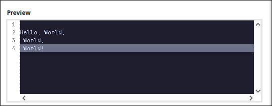
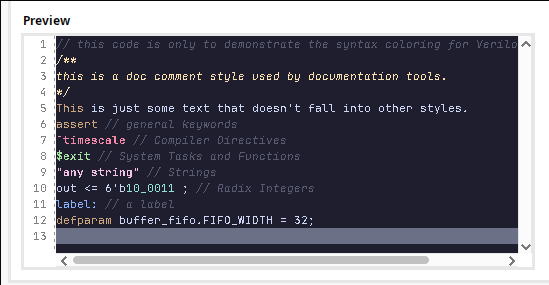

<h3 align="center">
	<br/>
	
	Catppuccin for <a href="https://github.com/catppuccin/template">Vivado</a>
	
</h3>

<p align="center">
	<a href="https://github.com/Boopwyn/vivado/stargazers">
		
	</a>
	<a href="https://github.com/Boopwyn/vivado/issues">
		
	</a>
	<a href="https://github.com/Boopwyn/vivado/contributors">
		
	</a>
</p>

## Previews

<!-- <details> -->
<!-- <summary>🌻 Latte</summary> -->
<!--  -->
<!-- </details> -->
<!-- <details> -->
<!-- <summary>🪴 Frappé</summary> -->
<!--  -->
<!-- </details> -->
<!-- <details> -->
<!-- <summary>🌺 Macchiato</summary> -->
<!--  -->
<!-- </details> -->
<details>
<summary>🌿 Mocha</summary>


</details>

## 💝 Thanks to

- [Boopwyn](https://github.com/Boopwyn)

&nbsp;

<p align="center">
	
</p>

<p align="center"> Copyright &copy; 2021-present <a href="https://github.com/catppuccin" target="_blank">Catppuccin Org</a>
</p>

<p align="center">
	<a href="https://github.com/catppuccin/catppuccin/blob/main/LICENSE"></a>
</p>


## Installation

1. Download the provided `Catpuccin Mocha.xmltheme` 
2. Locate your Vivado **themes folder** (replace version with your installed version):
   * **Windows:**

     ```
     C:\Users\YOUR_USERNAME\AppData\Roaming\Xilinx\Vivado\VERSION\themes
     ```
   * **Linux/Mac:**

     ```
     $HOME/.Xilinx/Vivado/VERSION/themes
    ```
3. Copy the `Catpuccin Mocha.xmltheme` file to the themes folder.
4. Open Vivado -> **Tools -> Settings -> Colors**.
5. Select **Catpuccin Mocha** from the theme dropdown.

